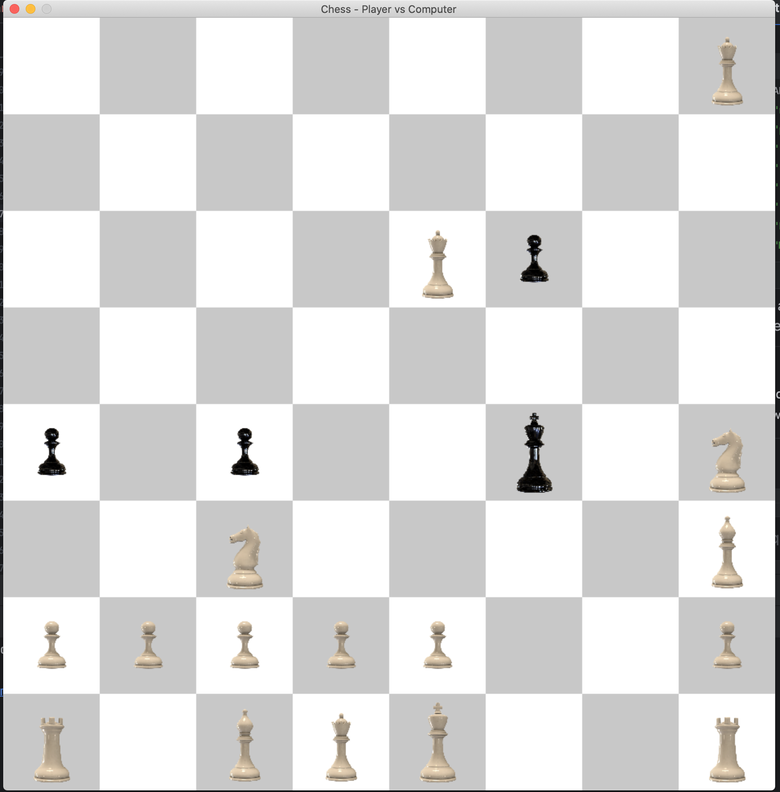

## Basic chess engine using Pygame and Stockfish

### Ressources:
- https://pixabay.com/images/search/user_id%3a7990144%20white%20knight%20chess/
- https://github.com/mcostalba/Stockfish.git
- https://github.com/phracker/MacOSX-SDKs/releases/tag/10.15

Compiling instructions:
- [x] macOSX 10.15:
    ```
    sudo mv MacOSX10.15.sdk /Library/Developer/CommandLineTools/SDKs/
    export SDKROOT=/Library/Developer/CommandLineTools/SDKs/MacOSX10.15.sdk
    uname -a
    make build ARCH=x86-64 COMP=clang
  ```
### White wins!
